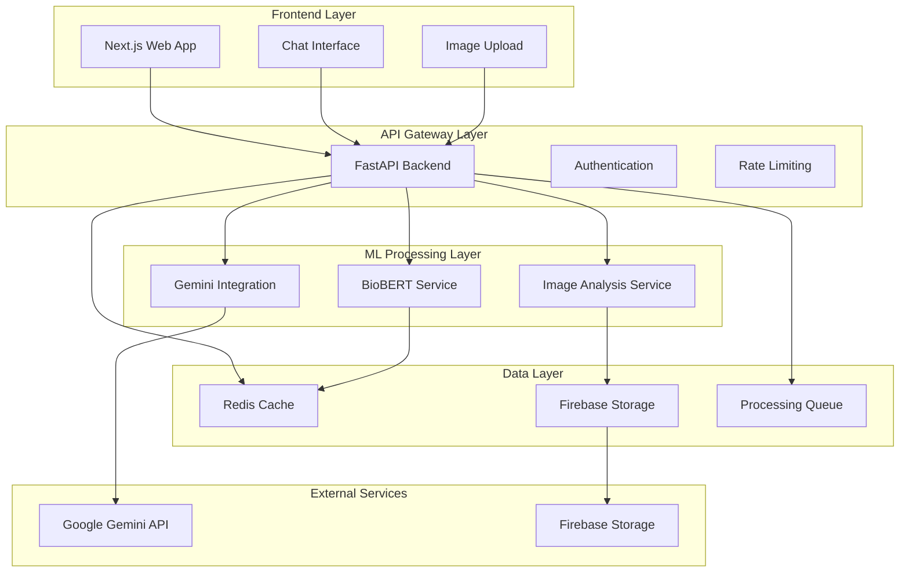

# Design Document: BioLens Symptom Checker

## Overview

BioLens is a privacy-focused healthcare accessibility application that combines natural language processing and computer vision to provide preliminary health assessments. The system processes user-submitted symptom descriptions and medical images to generate risk assessments and provide guidance toward appropriate medical care.

The architecture emphasizes privacy through on-device processing where feasible, ethical AI practices with comprehensive medical disclaimers, and a clean separation of concerns between frontend presentation, backend orchestration, and specialized ML processing components.

Key design principles:
- **Privacy First**: Minimize data retention and maximize on-device processing
- **Medical Ethics**: Clear disclaimers and appropriate escalation for high-risk conditions
- **Modular Architecture**: Clean separation between UI, API, and ML components
- **Scalable Processing**: Support for both local and cloud-based ML inference
- **User Experience**: Conversational interface that feels supportive and reassuring

## Architecture

The system follows a microservices architecture with clear separation between presentation, business logic, and ML processing layers:



### Component Responsibilities

**Frontend (Next.js)**:
- Conversational chat interface with real-time messaging
- Secure image upload with drag-and-drop functionality
- Responsive design for desktop and mobile devices
- Client-side input validation and sanitization
- Progress indicators for processing states

**API Gateway (FastAPI)**:
- Request routing and orchestration between ML services
- Authentication and session management
- Rate limiting and abuse prevention
- Input validation and sanitization
- Response formatting and error handling
- Privacy controls and data retention policies

**ML Processing Services**:
- **BioBERT Service**: Symptom analysis and medical entity extraction
- **Image Analysis Service**: Computer vision for skin condition detection
- **Gemini Integration**: Natural language response generation

**Data Layer**:
- **Redis Cache**: Session data and temporary processing results
- **Firebase Storage**: Temporary image storage with automatic cleanup
- **Processing Queue**: Asynchronous ML task management

## Components and Interfaces

### Frontend Components

**ChatInterface Component**:
```typescript
interface ChatMessage {
  id: string;
  type: 'user' | 'system' | 'analysis';
  content: string;
  timestamp: Date;
  metadata?: {
    riskLevel?: 'low' | 'medium' | 'high';
    imageId?: string;
    analysisId?: string;
  };
}

interface ChatInterfaceProps {
  messages: ChatMessage[];
  onSendMessage: (content: string) => void;
  onUploadImage: (file: File) => void;
  isProcessing: boolean;
}
```

**ImageUpload Component**:
```typescript
interface ImageUploadProps {
  onUpload: (file: File) => Promise<string>;
  maxSize: number; // 10MB
  acceptedFormats: string[]; // ['image/jpeg', 'image/png', 'image/webp']
  onError: (error: string) => void;
}
```

### Backend API Interfaces

**Symptom Analysis Endpoint**:
```python
class SymptomAnalysisRequest(BaseModel):
    text: str
    session_id: str
    context: Optional[List[str]] = None

class SymptomAnalysisResponse(BaseModel):
    analysis_id: str
    entities: List[MedicalEntity]
    risk_score: float
    confidence: float
    processing_time: float
```

**Image Analysis Endpoint**:
```python
class ImageAnalysisRequest(BaseModel):
    image_id: str
    session_id: str
    metadata: Optional[Dict[str, Any]] = None

class ImageAnalysisResponse(BaseModel):
    analysis_id: str
    conditions: List[DetectedCondition]
    confidence_scores: Dict[str, float]
    processing_time: float
```

**Combined Assessment Endpoint**:
```python
class AssessmentRequest(BaseModel):
    session_id: str
    symptom_analysis_id: Optional[str] = None
    image_analysis_id: Optional[str] = None

class AssessmentResponse(BaseModel):
    assessment_id: str
    risk_level: RiskLevel
    summary: str
    recommendations: List[Recommendation]
    disclaimers: List[str]
    referral_suggestions: List[ReferralSuggestion]
```

### ML Service Interfaces

**BioBERT Service**:
```python
class BioBERTProcessor:
    def analyze_symptoms(self, text: str) -> SymptomAnalysis:
        """Extract medical entities and assess symptom severity"""
        pass
    
    def extract_entities(self, text: str) -> List[MedicalEntity]:
        """Extract medical entities using BioBERT"""
        pass
    
    def calculate_risk_score(self, entities: List[MedicalEntity]) -> float:
        """Calculate preliminary risk assessment"""
        pass
```

**Image Analysis Service**:
```python
class ImageAnalyzer:
    def analyze_skin_condition(self, image_path: str) -> SkinAnalysis:
        """Analyze skin conditions using CNN model"""
        pass
    
    def preprocess_image(self, image: np.ndarray) -> np.ndarray:
        """Standardize image for model input"""
        pass
    
    def postprocess_results(self, predictions: np.ndarray) -> List[DetectedCondition]:
        """Convert model outputs to structured results"""
        pass
```

## Data Models

### Core Domain Models

**Medical Entity**:
```python
class MedicalEntity(BaseModel):
    text: str
    label: str  # SYMPTOM, CONDITION, BODY_PART, SEVERITY, etc.
    confidence: float
    start_pos: int
    end_pos: int
    normalized_form: Optional[str] = None
```

**Detected Condition**:
```python
class DetectedCondition(BaseModel):
    condition_name: str
    confidence: float
    severity: str  # 'mild', 'moderate', 'severe'
    category: str  # 'dermatological', 'infectious', etc.
    description: str
    requires_attention: bool
```

**Risk Assessment**:
```python
class RiskLevel(str, Enum):
    LOW = "low"
    MEDIUM = "medium" 
    HIGH = "high"
    EMERGENCY = "emergency"

class RiskAssessment(BaseModel):
    level: RiskLevel
    score: float  # 0.0 to 1.0
    factors: List[str]
    confidence: float
    timestamp: datetime
```

**User Session**:
```python
class UserSession(BaseModel):
    session_id: str
    created_at: datetime
    last_activity: datetime
    messages: List[ChatMessage]
    analyses: List[str]  # Analysis IDs
    privacy_settings: PrivacySettings
    expires_at: datetime
```

**Privacy Settings**:
```python
class PrivacySettings(BaseModel):
    data_retention_hours: int = 24
    allow_cloud_processing: bool = True
    anonymize_data: bool = True
    delete_images_immediately: bool = True
```

### Processing Models

**Analysis Pipeline**:
```python
class AnalysisPipeline(BaseModel):
    pipeline_id: str
    session_id: str
    steps: List[ProcessingStep]
    status: ProcessingStatus
    created_at: datetime
    completed_at: Optional[datetime] = None
    error_message: Optional[str] = None

class ProcessingStep(BaseModel):
    step_name: str
    status: ProcessingStatus
    input_data: Dict[str, Any]
    output_data: Optional[Dict[str, Any]] = None
    processing_time: Optional[float] = None
    error_message: Optional[str] = None

class ProcessingStatus(str, Enum):
    PENDING = "pending"
    PROCESSING = "processing"
    COMPLETED = "completed"
    FAILED = "failed"
```

### Response Generation Models

**Generated Response**:
```python
class GeneratedResponse(BaseModel):
    response_id: str
    content: str
    risk_level: RiskLevel
    disclaimers: List[str]
    recommendations: List[Recommendation]
    referrals: List[ReferralSuggestion]
    sources: List[str]
    generated_at: datetime

class Recommendation(BaseModel):
    type: str  # 'immediate_care', 'monitoring', 'lifestyle', etc.
    priority: int  # 1-5, 1 being highest
    description: str
    timeframe: Optional[str] = None

class ReferralSuggestion(BaseModel):
    specialty: str  # 'dermatology', 'primary_care', 'emergency', etc.
    urgency: str  # 'immediate', 'within_week', 'routine'
    reason: str
    location_based: bool = True
```

## Correctness Properties

*A property is a characteristic or behavior that should hold true across all valid executions of a system—essentially, a formal statement about what the system should do. Properties serve as the bridge between human-readable specifications and machine-verifiable correctness guarantees.*

The following properties define the correctness requirements for the BioLens system, derived from the acceptance criteria in the requirements document. Each property is designed to be testable through property-based testing with generated inputs.

### Property 1: Symptom Analysis Completeness
*For any* valid symptom text input, the BioBERT analyzer should extract at least one medical entity and generate a risk score between 0.0 and 1.0 with a confidence measure.
**Validates: Requirements 1.1, 1.2, 1.3**

### Property 2: Input Validation and Error Handling
*For any* invalid or malformed input (empty strings, non-medical text, unsupported formats), the system should reject the input gracefully and provide clear error messages without crashing.
**Validates: Requirements 1.4, 2.5**

### Property 3: Image Processing Pipeline Integrity
*For any* valid medical image in supported formats (JPEG, PNG, WebP) under 10MB, the system should successfully store, queue, process, and extract visual medical features within the specified time limits.
**Validates: Requirements 2.1, 2.2, 2.3, 2.6**

### Property 4: Multimodal Assessment Integration
*For any* combination of text symptoms and image analysis results, the risk scorer should generate a combined assessment that incorporates both data sources and produces a coherent risk level.
**Validates: Requirements 2.4, 3.1**

### Property 5: Response Generation with Disclaimers
*For any* health assessment result, the response generator should create user-friendly explanations that include appropriate medical disclaimers and emphasize the preliminary nature of AI analysis.
**Validates: Requirements 3.2, 6.2, 6.4**

### Property 6: Risk-Based Escalation
*For any* assessment with high risk level, the system should emphasize immediate professional medical attention and provide strong recommendations for professional consultation.
**Validates: Requirements 3.3, 6.3**

### Property 7: Emergency Detection and Redirection
*For any* input containing emergency-related keywords or symptoms, the system should detect the emergency context and redirect users to appropriate emergency services.
**Validates: Requirements 6.6**

### Property 8: Data Privacy and Retention
*For any* user session and uploaded images, the system should automatically delete temporary data within specified timeframes (24 hours for images, session end for conversation data) while maintaining proper encryption during processing.
**Validates: Requirements 4.2, 4.3, 4.4**

### Property 9: Session Context Preservation
*For any* ongoing conversation within a session, the system should maintain context from previous exchanges and use that context to inform subsequent responses and assessments.
**Validates: Requirements 1.5**

### Property 10: Performance and Responsiveness
*For any* valid request under normal load conditions, the system should complete text analysis within 10 seconds and image analysis within 30 seconds while providing progress indicators.
**Validates: Requirements 7.2, 7.3, 5.6**

### Property 11: System Resilience
*For any* external service failure (Firebase, Gemini API, ML models), the system should handle the failure gracefully, provide appropriate error messages, and continue operating with degraded functionality where possible.
**Validates: Requirements 7.4, 8.5**

### Property 12: Transparency and User Communication
*For any* data processing operation, the system should provide clear information about what data is being processed, where it's being processed, and include appropriate progress indicators and user-friendly language.
**Validates: Requirements 4.6, 5.3**

## Error Handling

The system implements comprehensive error handling across all layers:

### Input Validation Errors
- **Symptom Text**: Empty strings, non-text input, excessively long input (>10,000 characters)
- **Images**: Unsupported formats, oversized files (>10MB), corrupted files, non-image files
- **Session Management**: Invalid session IDs, expired sessions, concurrent session conflicts

### Processing Errors
- **BioBERT Service**: Model loading failures, inference timeouts, memory constraints
- **Image Analysis**: Preprocessing failures, model prediction errors, feature extraction issues
- **Response Generation**: Gemini API failures, rate limiting, content filtering issues

### External Service Errors
- **Firebase Storage**: Upload failures, storage quota exceeded, network connectivity issues
- **Gemini API**: Rate limiting, service unavailability, content policy violations
- **Redis Cache**: Connection failures, memory limits, data corruption

### Error Response Strategy
```python
class ErrorResponse(BaseModel):
    error_code: str
    message: str
    user_message: str  # User-friendly explanation
    retry_possible: bool
    suggested_action: Optional[str] = None
    timestamp: datetime
```

**Error Escalation Levels**:
1. **User Recoverable**: Input validation errors, format issues
2. **System Degraded**: Single service failures with fallback options
3. **System Critical**: Multiple service failures, data corruption
4. **Medical Emergency**: High-risk conditions requiring immediate attention

## Testing Strategy

The BioLens system requires a comprehensive testing approach that combines traditional unit testing with property-based testing to ensure correctness across the wide range of possible medical inputs and scenarios.

### Property-Based Testing Framework

**Framework Selection**: We will use Hypothesis for Python components and fast-check for TypeScript frontend components. Each property test will run a minimum of 100 iterations to ensure comprehensive input coverage.

**Test Data Generation Strategy**:
- **Medical Text Generation**: Create generators for valid symptom descriptions, medical terminology, and edge cases (empty strings, non-medical text, mixed languages)
- **Image Generation**: Generate test images in various formats, sizes, and quality levels, including medical images and non-medical images
- **Session Data Generation**: Create realistic user session patterns with varying conversation lengths and interaction types
- **Error Condition Generation**: Systematically generate various failure scenarios for external services and system components

### Property Test Implementation

Each correctness property will be implemented as a dedicated property-based test:

**Property 1 Test**: Generate random symptom descriptions and verify BioBERT processing completeness
- **Tag**: Feature: biolens-symptom-checker, Property 1: Symptom Analysis Completeness
- **Generator**: Medical symptom text with varying complexity and terminology
- **Assertion**: Valid entities extracted, risk score in [0.0, 1.0], confidence measure present

**Property 2 Test**: Generate invalid inputs and verify graceful error handling
- **Tag**: Feature: biolens-symptom-checker, Property 2: Input Validation and Error Handling
- **Generator**: Invalid text inputs, malformed data, edge cases
- **Assertion**: Appropriate error responses, no system crashes, clear error messages

**Property 3 Test**: Generate medical images and verify complete processing pipeline
- **Tag**: Feature: biolens-symptom-checker, Property 3: Image Processing Pipeline Integrity
- **Generator**: Valid medical images in supported formats and sizes
- **Assertion**: Successful storage, queuing, processing, and feature extraction

**Property 4 Test**: Generate combinations of text and image data for multimodal assessment
- **Tag**: Feature: biolens-symptom-checker, Property 4: Multimodal Assessment Integration
- **Generator**: Paired symptom text and medical images
- **Assertion**: Combined risk assessment incorporates both data sources coherently

**Property 5 Test**: Generate assessment results and verify response generation with disclaimers
- **Tag**: Feature: biolens-symptom-checker, Property 5: Response Generation with Disclaimers
- **Generator**: Various assessment results with different risk levels
- **Assertion**: User-friendly explanations include required disclaimers

**Property 6 Test**: Generate high-risk scenarios and verify escalation messaging
- **Tag**: Feature: biolens-symptom-checker, Property 6: Risk-Based Escalation
- **Generator**: High-risk medical conditions and symptoms
- **Assertion**: Strong professional consultation recommendations present

**Property 7 Test**: Generate emergency-related inputs and verify redirection
- **Tag**: Feature: biolens-symptom-checker, Property 7: Emergency Detection and Redirection
- **Generator**: Emergency keywords and critical symptoms
- **Assertion**: Emergency services redirection triggered appropriately

**Property 8 Test**: Generate user sessions and verify data privacy compliance
- **Tag**: Feature: biolens-symptom-checker, Property 8: Data Privacy and Retention
- **Generator**: User sessions with various data types and timeframes
- **Assertion**: Automatic data deletion within specified timeframes, encryption during processing

**Property 9 Test**: Generate conversation sequences and verify context preservation
- **Tag**: Feature: biolens-symptom-checker, Property 9: Session Context Preservation
- **Generator**: Multi-turn conversations with varying context complexity
- **Assertion**: Previous context influences subsequent responses appropriately

**Property 10 Test**: Generate requests under load and verify performance requirements
- **Tag**: Feature: biolens-symptom-checker, Property 10: Performance and Responsiveness
- **Generator**: Various request types with simulated load conditions
- **Assertion**: Response times within specified limits, progress indicators shown

**Property 11 Test**: Generate service failure scenarios and verify system resilience
- **Tag**: Feature: biolens-symptom-checker, Property 11: System Resilience
- **Generator**: Various external service failure conditions
- **Assertion**: Graceful degradation, appropriate error handling, continued operation

**Property 12 Test**: Generate processing operations and verify transparency
- **Tag**: Feature: biolens-symptom-checker, Property 12: Transparency and User Communication
- **Generator**: Various data processing scenarios
- **Assertion**: Clear user communication, progress indicators, accessible language

### Unit Testing Strategy

**Complementary Unit Tests**: Focus on specific examples, integration points, and edge cases that complement the property-based tests:

- **Medical Entity Extraction**: Test specific medical terms and their correct classification
- **Risk Scoring Logic**: Test boundary conditions and specific risk calculation scenarios
- **Image Preprocessing**: Test specific image transformations and format conversions
- **API Integration**: Test specific request/response patterns with external services
- **Session Management**: Test specific session lifecycle scenarios
- **Error Handling**: Test specific error conditions and recovery mechanisms

### Integration Testing

**End-to-End Workflows**: Test complete user journeys from symptom input to final assessment:
- Text-only symptom analysis workflow
- Image-only analysis workflow  
- Combined text and image analysis workflow
- Emergency detection and escalation workflow
- Privacy and data cleanup workflow

**External Service Integration**: Test integration with Firebase Storage, Gemini API, and other external dependencies using both real services (in staging) and mocked services (in unit tests).

### Performance and Load Testing

**Performance Benchmarks**: Establish baseline performance metrics for:
- BioBERT inference time with various input lengths
- Image processing time with different image sizes and formats
- End-to-end response time for complete assessment workflows
- Concurrent user capacity and resource utilization

**Load Testing Scenarios**: Test system behavior under various load conditions:
- Gradual load increase to identify breaking points
- Spike testing for sudden traffic increases
- Sustained load testing for extended periods
- Resource exhaustion scenarios (memory, storage, API quotas)