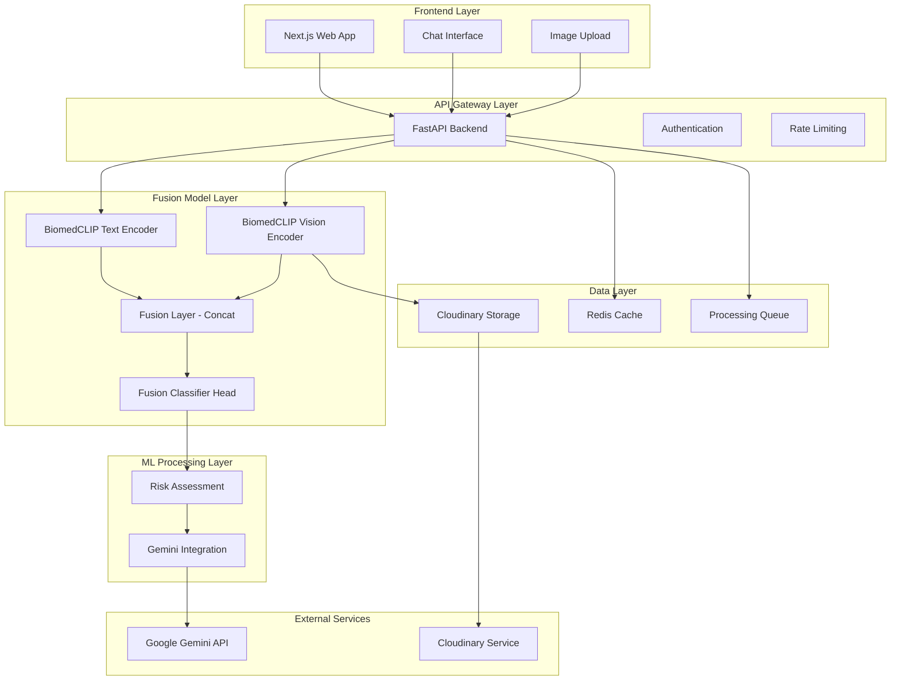
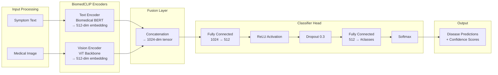

# Design Document: BioLens Symptom Checker with Fusion Model Architecture

## Overview

BioLens is a privacy-focused healthcare accessibility application that combines advanced multimodal AI through BiomedCLIP fusion models to provide preliminary health assessments. The system processes user-submitted symptom descriptions and medical images using state-of-the-art biomedical encoders, fuses the information through a trained classifier, and generates risk assessments with guidance toward appropriate medical care.

The architecture emphasizes privacy through on-device processing where feasible, ethical AI practices with comprehensive medical disclaimers, and a clean separation of concerns between frontend presentation, backend orchestration, and specialized ML processing components. The core innovation is the fusion model that combines BiomedCLIP vision and text encoders to create unified disease predictions with improved accuracy over single-modality approaches.

Key design principles:
- **Multimodal Fusion**: Advanced BiomedCLIP-based fusion of text and image data for superior accuracy
- **Privacy First**: Minimize data retention and maximize on-device processing
- **Medical Ethics**: Clear disclaimers and appropriate escalation for high-risk conditions
- **Modular Architecture**: Clean separation between UI, API, and ML components
- **Scalable Processing**: Support for both local and cloud-based ML inference
- **User Experience**: Conversational interface that feels supportive and reassuring

## Architecture

The system follows a microservices architecture with a sophisticated fusion model at its core, providing clean separation between presentation, business logic, and ML processing layers:



### Fusion Model Architecture Detail

The core innovation is the BiomedCLIP-based fusion model:



### Component Responsibilities

**Frontend (Next.js)**:
- Conversational chat interface with real-time messaging
- Secure image upload with drag-and-drop functionality
- Responsive design for desktop and mobile devices
- Client-side input validation and sanitization
- Progress indicators for processing states

**API Gateway (FastAPI)**:
- Request routing and orchestration between ML services
- Authentication and session management
- Rate limiting and abuse prevention
- Input validation and sanitization
- Response formatting and error handling
- Privacy controls and data retention policies

**Fusion Model Components**:
- **BiomedCLIP Text Encoder**: Biomedical text understanding with 512-dimensional embeddings
- **BiomedCLIP Vision Encoder**: Medical image analysis with 512-dimensional embeddings
- **Fusion Layer**: Concatenation of text and vision embeddings (1024-dimensional)
- **Classifier Head**: Trained neural network for disease prediction from fused embeddings

**ML Processing Services**:
- **Risk Assessment**: Convert classifier predictions to risk levels and recommendations
- **Gemini Integration**: Natural language response generation

**Data Layer**:
- **Redis Cache**: Session data and temporary processing results
- **Cloudinary Storage**: Temporary image storage with automatic cleanup
- **Processing Queue**: Asynchronous ML task management

## Components and Interfaces

### Frontend Components

**ChatInterface Component**:
```typescript
interface ChatMessage {
  id: string;
  type: 'user' | 'system' | 'analysis';
  content: string;
  timestamp: Date;
  metadata?: {
    riskLevel?: 'low' | 'medium' | 'high';
    imageId?: string;
    analysisId?: string;
    confidence?: number;
  };
}

interface ChatInterfaceProps {
  messages: ChatMessage[];
  onSendMessage: (content: string) => void;
  onUploadImage: (file: File) => void;
  isProcessing: boolean;
}
```

**ImageUpload Component**:
```typescript
interface ImageUploadProps {
  onUpload: (file: File) => Promise<string>;
  maxSize: number; // 10MB
  acceptedFormats: string[]; // ['image/jpeg', 'image/png', 'image/webp']
  onError: (error: string) => void;
}
```

### Backend API Interfaces

**Fusion Model Analysis Endpoint**:
```python
class FusionAnalysisRequest(BaseModel):
    text: Optional[str] = None
    image_id: Optional[str] = None
    session_id: str
    context: Optional[List[str]] = None

class FusionAnalysisResponse(BaseModel):
    analysis_id: str
    predictions: List[DiseasePrediction]
    risk_level: RiskLevel
    confidence: float
    processing_time: float
    modality: str  # 'text', 'image', 'multimodal'
```

**Text Embedding Endpoint**:
```python
class TextEmbeddingRequest(BaseModel):
    text: str
    session_id: str

class TextEmbeddingResponse(BaseModel):
    embedding_id: str
    embedding: List[float]  # 512-dimensional
    processing_time: float
```

**Image Embedding Endpoint**:
```python
class ImageEmbeddingRequest(BaseModel):
    image_id: str
    session_id: str

class ImageEmbeddingResponse(BaseModel):
    embedding_id: str
    embedding: List[float]  # 512-dimensional
    processing_time: float
```

### Fusion Model Interfaces

**BiomedCLIP Text Encoder**:
```python
class BiomedCLIPTextEncoder:
    def encode_text(self, text: str) -> np.ndarray:
        """Generate 512-dimensional biomedical text embedding"""
        pass
    
    def preprocess_text(self, text: str) -> str:
        """Clean and prepare text for encoding"""
        pass
    
    def validate_input(self, text: str) -> bool:
        """Validate text input for processing"""
        pass
```

**BiomedCLIP Vision Encoder**:
```python
class BiomedCLIPVisionEncoder:
    def encode_image(self, image_path: str) -> np.ndarray:
        """Generate 512-dimensional biomedical image embedding"""
        pass
    
    def preprocess_image(self, image: np.ndarray) -> np.ndarray:
        """Standardize image for model input"""
        pass
    
    def validate_image(self, image_path: str) -> bool:
        """Validate image format and size"""
        pass
```

**Fusion Classifier**:
```python
class FusionClassifier:
    def predict_multimodal(self, text_embedding: np.ndarray, 
                          image_embedding: np.ndarray) -> DiseasePrediction:
        """Make disease prediction from fused embeddings"""
        pass
    
    def predict_text_only(self, text_embedding: np.ndarray) -> DiseasePrediction:
        """Make prediction from text embedding only"""
        pass
    
    def predict_image_only(self, image_embedding: np.ndarray) -> DiseasePrediction:
        """Make prediction from image embedding only"""
        pass
    
    def fuse_embeddings(self, text_emb: np.ndarray, 
                       image_emb: np.ndarray) -> np.ndarray:
        """Concatenate embeddings for fusion layer"""
        pass
```

## Data Models

### Core Domain Models

**Disease Prediction**:
```python
class DiseasePrediction(BaseModel):
    condition_name: str
    confidence: float
    severity: str  # 'mild', 'moderate', 'severe'
    category: str  # 'dermatological', 'infectious', etc.
    description: str
    requires_attention: bool
    prediction_source: str  # 'text', 'image', 'multimodal'

class FusionPredictionResult(BaseModel):
    predictions: List[DiseasePrediction]
    top_prediction: DiseasePrediction
    overall_confidence: float
    risk_level: RiskLevel
    modality_used: str  # 'text', 'image', 'multimodal'
```

**Embedding Models**:
```python
class TextEmbedding(BaseModel):
    embedding_id: str
    text_input: str
    embedding_vector: List[float]  # 512-dimensional
    created_at: datetime
    session_id: str

class ImageEmbedding(BaseModel):
    embedding_id: str
    image_id: str
    embedding_vector: List[float]  # 512-dimensional
    created_at: datetime
    session_id: str

class FusedEmbedding(BaseModel):
    fusion_id: str
    text_embedding_id: Optional[str] = None
    image_embedding_id: Optional[str] = None
    fused_vector: List[float]  # 1024-dimensional
    created_at: datetime
    session_id: str
```

**Risk Assessment**:
```python
class RiskLevel(str, Enum):
    LOW = "low"
    MEDIUM = "medium" 
    HIGH = "high"
    EMERGENCY = "emergency"

class RiskAssessment(BaseModel):
    level: RiskLevel
    score: float  # 0.0 to 1.0
    factors: List[str]
    confidence: float
    timestamp: datetime
    prediction_basis: str  # 'fusion_model', 'text_only', 'image_only'
```

**User Session**:
```python
class UserSession(BaseModel):
    session_id: str
    created_at: datetime
    last_activity: datetime
    messages: List[ChatMessage]
    analyses: List[str]  # Analysis IDs
    embeddings: List[str]  # Embedding IDs
    privacy_settings: PrivacySettings
    expires_at: datetime
```

**Privacy Settings**:
```python
class PrivacySettings(BaseModel):
    data_retention_hours: int = 24
    allow_cloud_processing: bool = True
    anonymize_data: bool = True
    delete_images_immediately: bool = True
    encryption_required: bool = True
```

### Processing Models

**Fusion Analysis Pipeline**:
```python
class FusionAnalysisPipeline(BaseModel):
    pipeline_id: str
    session_id: str
    text_input: Optional[str] = None
    image_id: Optional[str] = None
    steps: List[ProcessingStep]
    status: ProcessingStatus
    created_at: datetime
    completed_at: Optional[datetime] = None
    error_message: Optional[str] = None

class ProcessingStep(BaseModel):
    step_name: str  # 'text_encoding', 'image_encoding', 'fusion', 'classification'
    status: ProcessingStatus
    input_data: Dict[str, Any]
    output_data: Optional[Dict[str, Any]] = None
    processing_time: Optional[float] = None
    error_message: Optional[str] = None

class ProcessingStatus(str, Enum):
    PENDING = "pending"
    PROCESSING = "processing"
    COMPLETED = "completed"
    FAILED = "failed"
```

### Response Generation Models

**Generated Response**:
```python
class GeneratedResponse(BaseModel):
    response_id: str
    content: str
    risk_level: RiskLevel
    disclaimers: List[str]
    recommendations: List[Recommendation]
    referrals: List[ReferralSuggestion]
    sources: List[str]
    generated_at: datetime
    confidence_explanation: str

class Recommendation(BaseModel):
    type: str  # 'immediate_care', 'monitoring', 'lifestyle', etc.
    priority: int  # 1-5, 1 being highest
    description: str
    timeframe: Optional[str] = None
    based_on: str  # 'fusion_prediction', 'text_analysis', 'image_analysis'

class ReferralSuggestion(BaseModel):
    specialty: str  # 'dermatology', 'primary_care', 'emergency', etc.
    urgency: str  # 'immediate', 'within_week', 'routine'
    reason: str
    location_based: bool = True
    confidence_threshold: float  # Minimum confidence for this referral
```

## Correctness Properties

*A property is a characteristic or behavior that should hold true across all valid executions of a system—essentially, a formal statement about what the system should do. Properties serve as the bridge between human-readable specifications and machine-verifiable correctness guarantees.*

The following properties define the correctness requirements for the BioLens fusion model system, derived from the acceptance criteria in the requirements document. Each property is designed to be testable through property-based testing with generated inputs.

### Property 1: BiomedCLIP Text Encoding Completeness
*For any* valid symptom text input, the BiomedCLIP text encoder should generate a 512-dimensional embedding vector with proper normalization and consistent format.
**Validates: Requirements 1.1**

### Property 2: BiomedCLIP Vision Encoding Completeness  
*For any* valid medical image in supported formats, the BiomedCLIP vision encoder should generate a 512-dimensional embedding vector with proper normalization and consistent format.
**Validates: Requirements 2.3**

### Property 3: Fusion Embedding Generation
*For any* combination of valid text and image embeddings, the fusion layer should generate a 1024-dimensional concatenated embedding that preserves information from both modalities.
**Validates: Requirements 3.1**

### Property 4: Multimodal Disease Prediction
*For any* fusion embedding, the classifier should generate disease predictions with confidence scores between 0.0 and 1.0, with the sum of all prediction confidences being properly normalized.
**Validates: Requirements 3.2**

### Property 5: Single-Modality Processing
*For any* input containing only text or only image data, the system should process it through the appropriate single encoder and generate valid predictions without requiring the missing modality.
**Validates: Requirements 3.7**

### Property 6: Input Validation and Error Handling
*For any* invalid input (malformed text, unsupported image formats, corrupted files), the system should reject the input gracefully with clear error messages and appropriate error codes.
**Validates: Requirements 1.4, 2.5**

### Property 7: Image Format and Size Validation
*For any* uploaded file, the system should correctly validate format (JPEG, PNG, WebP) and size (≤10MB), accepting valid files and rejecting invalid ones with specific error messages.
**Validates: Requirements 2.6**

### Property 8: Response Generation with Medical Context
*For any* disease prediction result, the response generator should create user-friendly explanations that include appropriate medical disclaimers and emphasize the preliminary nature of AI analysis.
**Validates: Requirements 3.3**

### Property 9: Risk-Based Response Customization
*For any* high-risk prediction result, the system should generate responses that emphasize immediate professional medical attention and include strong recommendations for professional consultation.
**Validates: Requirements 3.4**

### Property 10: Low-Risk Guidance with Disclaimers
*For any* low-risk prediction result, the system should provide general guidance while maintaining comprehensive medical disclaimers about AI limitations.
**Validates: Requirements 3.5**

### Property 11: Referral Suggestion Generation
*For any* disease prediction with sufficient confidence, the system should generate relevant doctor referral suggestions based on the detected condition category and severity.
**Validates: Requirements 3.6**

### Property 12: Session Context Preservation
*For any* ongoing conversation within a session, the system should maintain context from previous exchanges and use that context to inform subsequent responses and fusion model predictions.
**Validates: Requirements 1.5**

### Property 13: Secure Image Storage and Queuing
*For any* uploaded medical image, the system should store it securely in Cloudinary with proper encryption and queue it for processing with appropriate metadata tracking.
**Validates: Requirements 2.1, 2.2**

### Property 14: Embedding Preparation for Fusion
*For any* generated text or image embedding, the system should prepare it in the correct format and dimensionality for fusion processing, ensuring compatibility with the fusion layer.
**Validates: Requirements 1.2, 2.4**

### Property 15: Data Encryption During Transmission
*For any* cloud processing operation, the system should use encrypted data transmission to protect sensitive medical information during processing.
**Validates: Requirements 4.2**

### Property 16: Automatic Data Cleanup
*For any* processed image and associated embeddings, the system should automatically delete them from Cloudinary storage within 24 hours of processing completion.
**Validates: Requirements 4.3**

### Property 17: Session Data Cleanup
*For any* user session that ends, the system should clear all temporary data, conversation history, and cached embeddings associated with that session.
**Validates: Requirements 4.4**

### Property 18: Processing Transparency
*For any* data processing operation, the system should provide clear information about what data is being processed, which models are being used, and the current processing status.
**Validates: Requirements 4.6**

## Error Handling

The system implements comprehensive error handling across all layers, with special attention to fusion model processing:

### Input Validation Errors
- **Symptom Text**: Empty strings, non-text input, excessively long input (>10,000 characters), non-medical content
- **Images**: Unsupported formats, oversized files (>10MB), corrupted files, non-image files, low-quality images
- **Session Management**: Invalid session IDs, expired sessions, concurrent session conflicts

### Fusion Model Processing Errors
- **BiomedCLIP Text Encoder**: Model loading failures, tokenization errors, embedding generation failures, memory constraints
- **BiomedCLIP Vision Encoder**: Image preprocessing failures, model inference errors, embedding extraction issues, GPU memory limits
- **Fusion Layer**: Embedding dimension mismatches, concatenation failures, invalid embedding formats
- **Classifier Head**: Prediction failures, confidence calculation errors, output formatting issues

### External Service Errors
- **Cloudinary Storage**: Upload failures, storage quota exceeded, network connectivity issues, authentication failures
- **Gemini API**: Rate limiting, service unavailability, content policy violations, response parsing errors
- **Redis Cache**: Connection failures, memory limits, data corruption, serialization errors

### Error Response Strategy
```python
class FusionModelError(BaseModel):
    error_code: str
    message: str
    user_message: str  # User-friendly explanation
    retry_possible: bool
    suggested_action: Optional[str] = None
    timestamp: datetime
    component: str  # 'text_encoder', 'vision_encoder', 'fusion', 'classifier'
    
class ErrorSeverity(str, Enum):
    LOW = "low"          # Single modality failure, fallback available
    MEDIUM = "medium"    # Fusion failure, single modality still works
    HIGH = "high"        # Complete processing failure
    CRITICAL = "critical" # System-wide failure
```

**Error Escalation Levels**:
1. **User Recoverable**: Input validation errors, format issues, single modality failures
2. **System Degraded**: Fusion model failures with single-modality fallback
3. **System Critical**: Complete ML pipeline failures, external service outages
4. **Medical Emergency**: High-risk conditions requiring immediate attention (not an error, but priority handling)

## Testing Strategy

The BioLens fusion model system requires a comprehensive testing approach that combines traditional unit testing with property-based testing to ensure correctness across the wide range of possible medical inputs and multimodal scenarios.

### Property-Based Testing Framework

**Framework Selection**: We will use Hypothesis for Python components and fast-check for TypeScript frontend components. Each property test will run a minimum of 100 iterations to ensure comprehensive input coverage.

**Test Data Generation Strategy**:
- **Medical Text Generation**: Create generators for valid symptom descriptions, medical terminology, edge cases (empty strings, non-medical text, mixed languages), and various text lengths
- **Medical Image Generation**: Generate test images in various formats, sizes, and quality levels, including dermatological conditions, general medical images, and non-medical images
- **Embedding Generation**: Create synthetic embeddings with correct dimensionality for testing fusion layer functionality
- **Session Data Generation**: Create realistic user session patterns with varying conversation lengths and multimodal interaction types
- **Error Condition Generation**: Systematically generate various failure scenarios for fusion model components and external services

### Property Test Implementation

Each correctness property will be implemented as a dedicated property-based test:

**Property 1 Test**: Generate random symptom descriptions and verify BiomedCLIP text encoding completeness
- **Tag**: Feature: biolens-symptom-checker, Property 1: BiomedCLIP Text Encoding Completeness
- **Generator**: Medical symptom text with varying complexity and terminology
- **Assertion**: 512-dimensional embeddings generated, proper normalization, consistent format

**Property 2 Test**: Generate medical images and verify BiomedCLIP vision encoding completeness
- **Tag**: Feature: biolens-symptom-checker, Property 2: BiomedCLIP Vision Encoding Completeness
- **Generator**: Medical images in supported formats and sizes
- **Assertion**: 512-dimensional embeddings generated, proper normalization, consistent format

**Property 3 Test**: Generate text and image embeddings and verify fusion layer functionality
- **Tag**: Feature: biolens-symptom-checker, Property 3: Fusion Embedding Generation
- **Generator**: Pairs of valid 512-dimensional embeddings
- **Assertion**: 1024-dimensional concatenated embeddings preserve information from both modalities

**Property 4 Test**: Generate fusion embeddings and verify disease prediction generation
- **Tag**: Feature: biolens-symptom-checker, Property 4: Multimodal Disease Prediction
- **Generator**: Valid 1024-dimensional fusion embeddings
- **Assertion**: Disease predictions with normalized confidence scores between 0.0 and 1.0

**Property 5 Test**: Generate single-modality inputs and verify processing
- **Tag**: Feature: biolens-symptom-checker, Property 5: Single-Modality Processing
- **Generator**: Text-only or image-only inputs
- **Assertion**: Valid predictions generated without requiring missing modality

**Property 6 Test**: Generate invalid inputs and verify error handling
- **Tag**: Feature: biolens-symptom-checker, Property 6: Input Validation and Error Handling
- **Generator**: Invalid text inputs, malformed images, corrupted data
- **Assertion**: Appropriate error responses, no system crashes, clear error messages

**Property 7 Test**: Generate files of various formats and sizes for validation testing
- **Tag**: Feature: biolens-symptom-checker, Property 7: Image Format and Size Validation
- **Generator**: Files with different formats, sizes, and validity
- **Assertion**: Correct acceptance/rejection with specific error messages

**Property 8 Test**: Generate prediction results and verify response generation
- **Tag**: Feature: biolens-symptom-checker, Property 8: Response Generation with Medical Context
- **Generator**: Various disease prediction results
- **Assertion**: User-friendly explanations include required medical disclaimers

**Property 9 Test**: Generate high-risk predictions and verify response customization
- **Tag**: Feature: biolens-symptom-checker, Property 9: Risk-Based Response Customization
- **Generator**: High-risk disease predictions
- **Assertion**: Strong professional consultation recommendations present

**Property 10 Test**: Generate low-risk predictions and verify guidance with disclaimers
- **Tag**: Feature: biolens-symptom-checker, Property 10: Low-Risk Guidance with Disclaimers
- **Generator**: Low-risk disease predictions
- **Assertion**: General guidance with comprehensive medical disclaimers

**Property 11 Test**: Generate predictions and verify referral suggestion generation
- **Tag**: Feature: biolens-symptom-checker, Property 11: Referral Suggestion Generation
- **Generator**: Disease predictions with varying confidence levels
- **Assertion**: Relevant referral suggestions based on condition category and severity

**Property 12 Test**: Generate conversation sequences and verify context preservation
- **Tag**: Feature: biolens-symptom-checker, Property 12: Session Context Preservation
- **Generator**: Multi-turn conversations with varying context complexity
- **Assertion**: Previous context influences subsequent fusion model predictions

**Property 13 Test**: Generate image uploads and verify secure storage and queuing
- **Tag**: Feature: biolens-symptom-checker, Property 13: Secure Image Storage and Queuing
- **Generator**: Various medical images for upload
- **Assertion**: Secure Cloudinary storage with proper encryption and queuing

**Property 14 Test**: Generate embeddings and verify preparation for fusion
- **Tag**: Feature: biolens-symptom-checker, Property 14: Embedding Preparation for Fusion
- **Generator**: Text and image embeddings with various characteristics
- **Assertion**: Correct format and dimensionality for fusion layer compatibility

**Property 15 Test**: Generate cloud processing operations and verify encryption
- **Tag**: Feature: biolens-symptom-checker, Property 15: Data Encryption During Transmission
- **Generator**: Various data processing scenarios
- **Assertion**: Encrypted transmission for all cloud operations

**Property 16 Test**: Generate processed images and verify automatic cleanup
- **Tag**: Feature: biolens-symptom-checker, Property 16: Automatic Data Cleanup
- **Generator**: Processed images with various processing times
- **Assertion**: Automatic deletion from Cloudinary within 24 hours

**Property 17 Test**: Generate user sessions and verify session cleanup
- **Tag**: Feature: biolens-symptom-checker, Property 17: Session Data Cleanup
- **Generator**: User sessions with various data types and durations
- **Assertion**: Complete cleanup of temporary data and embeddings on session end

**Property 18 Test**: Generate processing operations and verify transparency
- **Tag**: Feature: biolens-symptom-checker, Property 18: Processing Transparency
- **Generator**: Various data processing scenarios
- **Assertion**: Clear information about processing status and model usage

### Unit Testing Strategy

**Complementary Unit Tests**: Focus on specific examples, integration points, and edge cases that complement the property-based tests:

- **Fusion Model Components**: Test specific embedding concatenation scenarios and classifier edge cases
- **BiomedCLIP Integration**: Test specific medical text and image processing examples
- **Risk Assessment Logic**: Test boundary conditions and specific risk calculation scenarios
- **API Integration**: Test specific request/response patterns with Cloudinary and Gemini services
- **Session Management**: Test specific session lifecycle scenarios with multimodal data
- **Error Handling**: Test specific error conditions and recovery mechanisms for fusion model failures

### Integration Testing

**End-to-End Workflows**: Test complete user journeys from symptom input to final assessment:
- Text-only symptom analysis workflow through BiomedCLIP text encoder
- Image-only analysis workflow through BiomedCLIP vision encoder
- Combined multimodal fusion analysis workflow
- Single-modality fallback scenarios when one modality fails
- Privacy and data cleanup workflow for multimodal data

**External Service Integration**: Test integration with Cloudinary Storage, Gemini API, and other external dependencies using both real services (in staging) and mocked services (in unit tests).

### Performance and Load Testing

**Fusion Model Performance Benchmarks**: Establish baseline performance metrics for:
- BiomedCLIP text encoding time with various input lengths
- BiomedCLIP vision encoding time with different image sizes and formats
- Fusion layer processing time for embedding concatenation
- Classifier inference time for disease prediction
- End-to-end multimodal analysis time for complete workflows

**Load Testing Scenarios**: Test system behavior under various load conditions:
- Concurrent multimodal analysis requests
- High-volume single-modality processing
- Fusion model memory usage under sustained load
- Cloudinary storage and retrieval performance
- GPU utilization for vision encoder processing