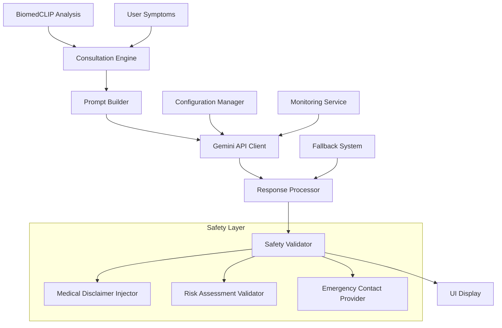

# Design Document

## Overview

The Gemini Consultation feature integrates Google's Gemini AI to provide intelligent medical consultation based on BiomedCLIP analysis results and user symptoms. This system transforms raw AI predictions into personalized, contextual medical guidance while maintaining strict medical safety standards and encouraging professional healthcare consultation.

The design follows a multi-layered approach: data processing, prompt engineering, API integration, and response formatting, all wrapped in comprehensive safety measures and fallback mechanisms.

## Architecture

### System Architecture



### Component Interaction Flow

1. **Input Processing**: BiomedCLIP results + user symptoms are sanitized and structured
2. **Prompt Generation**: Medical-grade prompts are constructed using templates and safety guidelines
3. **API Communication**: Secure calls to Gemini API with retry logic and error handling
4. **Response Processing**: Gemini responses are validated, formatted, and enhanced with safety information
5. **UI Integration**: Consultation results are seamlessly integrated into the existing BioLens interface

## Components and Interfaces

### 1. Consultation Engine (`ConsultationEngine`)

**Purpose**: Central orchestrator for the consultation process

**Interface**:
```typescript
interface ConsultationEngine {
  generateConsultation(
    analysisResult: AnalysisResult,
    symptoms: string,
    sessionId: string
  ): Promise<ConsultationResponse>
  
  validateInput(data: ConsultationInput): ValidationResult
  handleFallback(error: Error, input: ConsultationInput): ConsultationResponse
}
```

**Key Methods**:
- `generateConsultation()`: Main entry point for consultation generation
- `validateInput()`: Ensures input data meets safety and format requirements
- `handleFallback()`: Provides enhanced analysis when Gemini API is unavailable

### 2. Medical Prompt Builder (`MedicalPromptBuilder`)

**Purpose**: Constructs medically appropriate prompts for Gemini AI

**Interface**:
```typescript
interface MedicalPromptBuilder {
  buildConsultationPrompt(
    predictions: DetectedCondition[],
    symptoms: string,
    riskLevel: RiskLevel
  ): MedicalPrompt
  
  addSafetyInstructions(prompt: string): string
  formatPredictionsForPrompt(predictions: DetectedCondition[]): string
}
```

**Prompt Template Structure**:
```
<role>
You are a medical AI assistant providing supplementary health information.
You must NOT provide definitive diagnoses or replace professional medical care.
</role>

<safety_instructions>
1. Always emphasize that this is supplementary information only
2. Encourage users to consult healthcare professionals
3. For high-risk conditions, emphasize immediate medical attention
4. Avoid definitive diagnostic language
5. Include appropriate medical disclaimers
</safety_instructions>

<context>
BiomedCLIP Analysis Results:
[Structured prediction data with confidence scores]

User-Reported Symptoms:
[Sanitized symptom description]

Risk Assessment: [Low/Moderate/High]
</context>

<task>
Provide a structured medical consultation response including:
1. Condition Assessment (based on AI predictions)
2. Symptom Analysis (correlation with predictions)
3. Personalized Recommendations
4. Urgency Level and Next Steps
5. Educational Information
</task>

<output_format>
Structure your response as:
**Condition Assessment**: [Analysis of top predictions]
**Symptom Correlation**: [How symptoms relate to predictions]
**Recommendations**: [Personalized care suggestions]
**Urgency**: [Timeline for seeking care]
**Educational Info**: [Brief condition explanations]
**Important**: [Medical disclaimer and professional consultation emphasis]
</output_format>
```

### 3. Gemini API Client (`GeminiAPIClient`)

**Purpose**: Handles secure communication with Google Gemini API

**Interface**:
```typescript
interface GeminiAPIClient {
  sendConsultationRequest(prompt: MedicalPrompt): Promise<GeminiResponse>
  configureModel(settings: ModelSettings): void
  handleRateLimit(error: RateLimitError): Promise<void>
  validateAPIKey(): boolean
}
```

**Configuration**:
- Model: `gemini-1.5-pro` (for medical accuracy)
- Temperature: `0.3` (lower for medical consistency)
- Max Tokens: `2048` (comprehensive responses)
- Safety Settings: `BLOCK_MEDIUM_AND_ABOVE` for harmful content

### 4. Response Processor (`ResponseProcessor`)

**Purpose**: Processes and validates Gemini responses for medical safety

**Interface**:
```typescript
interface ResponseProcessor {
  processResponse(
    geminiResponse: string,
    originalInput: ConsultationInput
  ): ConsultationResponse
  
  validateMedicalSafety(response: string): SafetyValidation
  formatForDisplay(response: string): FormattedConsultation
  injectDisclaimers(response: string): string
}
```

### 5. Safety Validator (`SafetyValidator`)

**Purpose**: Ensures all responses meet medical safety standards

**Interface**:
```typescript
interface SafetyValidator {
  validateResponse(response: string): SafetyCheck
  checkForProhibitedContent(text: string): boolean
  ensureDisclaimersPresent(text: string): boolean
  assessUrgencyLevel(response: string, riskLevel: RiskLevel): UrgencyLevel
}
```

## Data Models

### ConsultationInput
```typescript
interface ConsultationInput {
  analysisResult: AnalysisResult
  symptoms: string
  sessionId: string
  timestamp: Date
  userAgent?: string
}
```

### ConsultationResponse
```typescript
interface ConsultationResponse {
  consultation: {
    conditionAssessment: string
    symptomCorrelation: string
    recommendations: string[]
    urgencyLevel: 'immediate' | 'within_week' | 'routine' | 'monitor'
    educationalInfo: string
    medicalDisclaimer: string
  }
  metadata: {
    modelUsed: string
    processingTime: number
    confidenceScore: number
    fallbackUsed: boolean
    safetyValidated: boolean
  }
  emergencyContacts?: EmergencyContact[]
}
```

### MedicalPrompt
```typescript
interface MedicalPrompt {
  systemInstruction: string
  userPrompt: string
  safetyInstructions: string[]
  contextData: {
    predictions: DetectedCondition[]
    symptoms: string
    riskLevel: RiskLevel
  }
}
```

Now I'll use the prework tool to analyze the acceptance criteria for correctness properties:

<function_calls>
<invoke name="prework">
<parameter name="featureName">gemini-consultation

## Correctness Properties

*A property is a characteristic or behavior that should hold true across all valid executions of a system-essentially, a formal statement about what the system should do. Properties serve as the bridge between human-readable specifications and machine-verifiable correctness guarantees.*

Based on the prework analysis, the following correctness properties ensure the Gemini consultation system operates safely and reliably:

### Property 1: API Connection Security
*For any* consultation request, when establishing connection to Gemini API, the system should use secure authentication and handle connection failures gracefully
**Validates: Requirements 1.2, 1.4**

### Property 2: Error Handling Consistency  
*For any* API error (rate limiting, authentication failure, network issues), the system should provide appropriate fallback responses without crashing
**Validates: Requirements 1.3, 1.4**

### Property 3: Medical Prompt Structure Compliance
*For any* consultation scenario, generated prompts should contain all required sections: role definition, safety instructions, context, task, and output format
**Validates: Requirements 2.1, 2.2**

### Property 4: Safety Instruction Inclusion
*For any* prompt generated by the system, it should include medical disclaimers and instructions to avoid definitive diagnoses
**Validates: Requirements 2.2, 2.4**

### Property 5: High-Risk Condition Emphasis
*For any* consultation involving high-risk conditions (melanoma, carcinoma), the prompt and response should emphasize urgent medical attention
**Validates: Requirements 2.3**

### Property 6: Data Extraction Consistency
*For any* BiomedCLIP analysis result, the consultation engine should successfully extract prediction data, confidence scores, and risk levels
**Validates: Requirements 3.1**

### Property 7: Symptom Sanitization
*For any* user-provided symptom description, the system should sanitize input by removing potentially harmful content while preserving medical relevance
**Validates: Requirements 3.2**

### Property 8: Structured Input Generation
*For any* combination of analysis results and symptoms, the system should create properly formatted input containing all required fields
**Validates: Requirements 3.3**

### Property 9: Response Structure Validation
*For any* Gemini API response, the processed consultation should contain all required sections: assessment, recommendations, urgency, and disclaimers
**Validates: Requirements 4.1, 4.2**

### Property 10: Personalization Accuracy
*For any* set of condition predictions and symptoms, consultation recommendations should be tailored to the specific conditions and symptom combinations
**Validates: Requirements 4.3**

### Property 11: Medical Disclaimer Presence
*For any* consultation response, it should contain prominent medical disclaimers emphasizing supplementary nature and encouraging professional consultation
**Validates: Requirements 5.1, 5.2**

### Property 12: Prohibited Content Avoidance
*For any* consultation response, it should not contain definitive diagnostic language or treatment prescriptions
**Validates: Requirements 5.3**

### Property 13: Performance Compliance
*For any* consultation request under normal conditions, the system should respond within 10 seconds
**Validates: Requirements 6.1**

### Property 14: Fallback Mechanism Reliability
*For any* Gemini API unavailability scenario, the system should provide enhanced analysis-based consultation without external API dependency
**Validates: Requirements 6.2**

### Property 15: Automatic Consultation Triggering
*For any* completed BiomedCLIP analysis, the system should automatically initiate consultation generation without manual intervention
**Validates: Requirements 7.1**

### Property 16: UI Integration Consistency
*For any* consultation response, it should be displayed in the designated UI section alongside existing analysis components
**Validates: Requirements 7.2**

## Error Handling

### Error Categories and Responses

1. **API Errors**
   - Authentication failures → Use fallback consultation with enhanced analysis
   - Rate limiting → Implement exponential backoff with user notification
   - Network timeouts → Retry with fallback after 3 attempts
   - Invalid responses → Validate and sanitize or use fallback

2. **Input Validation Errors**
   - Missing analysis data → Request re-analysis or use partial data with warnings
   - Invalid symptom format → Sanitize and proceed with available information
   - Malformed requests → Return structured error with guidance

3. **Safety Validation Errors**
   - Prohibited content detected → Filter content and add safety warnings
   - Missing disclaimers → Inject required disclaimers automatically
   - Inappropriate medical advice → Override with conservative recommendations

4. **Performance Errors**
   - Timeout exceeded → Return partial results with completion notification
   - Memory constraints → Optimize prompt size and retry
   - Concurrent request limits → Queue requests with user notification

### Fallback Consultation System

When Gemini API is unavailable, the system provides enhanced consultation using:

```typescript
interface FallbackConsultation {
  generateFromAnalysis(analysisResult: AnalysisResult, symptoms: string): ConsultationResponse
  enhanceRecommendations(predictions: DetectedCondition[]): string[]
  assessUrgency(riskLevel: RiskLevel, symptoms: string): UrgencyLevel
  formatEducationalContent(conditions: DetectedCondition[]): string
}
```

## Testing Strategy

### Dual Testing Approach

The system requires both unit testing and property-based testing for comprehensive coverage:

**Unit Tests**: Verify specific examples, edge cases, and error conditions
- API authentication scenarios
- Prompt template generation
- Response formatting
- Safety validation rules
- UI integration points

**Property Tests**: Verify universal properties across all inputs
- Prompt structure compliance across all consultation scenarios
- Safety instruction inclusion in all generated prompts
- Response format consistency for all API responses
- Error handling behavior for all failure modes
- Performance requirements under various load conditions

### Property-Based Testing Configuration

- **Testing Library**: Use `fast-check` for JavaScript/TypeScript property testing
- **Minimum Iterations**: 100 iterations per property test
- **Test Tags**: Each property test must reference its design document property
- **Tag Format**: `Feature: gemini-consultation, Property {number}: {property_text}`

### Testing Scenarios

1. **Medical Safety Testing**
   - Generate random condition combinations and verify safety compliance
   - Test various symptom descriptions for proper sanitization
   - Validate disclaimer presence across all response types

2. **API Integration Testing**
   - Test various API error scenarios and fallback mechanisms
   - Verify authentication handling across different failure modes
   - Test rate limiting and retry logic with simulated API responses

3. **Performance Testing**
   - Measure response times across different consultation complexities
   - Test concurrent request handling and resource management
   - Validate fallback performance when API is unavailable

4. **Content Validation Testing**
   - Test prompt generation across all medical condition categories
   - Verify response personalization with various symptom combinations
   - Validate educational content accuracy and appropriateness